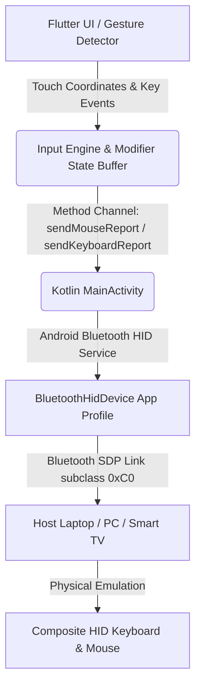

# 🐭 CouchMouse

[](https://developer.android.com/reference/android/bluetooth/BluetoothHidDevice)
[](https://flutter.dev)
[](#)

**CouchMouse** is a premium, driverless remote control application that transforms your Android device into a high-performance Bluetooth HID keyboard and trackpad. Controlling a home theater PC (HTPC), laptop, or presentation screen from your couch has never been more elegant or seamless.

By implementing native Android Bluetooth HID APIs and a custom composite HID descriptor, CouchMouse emulates a physical hardware keyboard and mouse combo over Bluetooth. **No client or companion server software is required on the host system**—your computer treats it exactly like a standard physical USB/Bluetooth receiver device.

---

## 🌟 Key Features

### 🔌 True Driverless Connectivity
* **Zero Companion Software:** No background services, server applications, or desktop clients to install on your computer.
* **Universal Compatibility:** Works out-of-the-box with Windows, macOS, Linux, ChromeOS, iPadOS, and Android TV—any device that accepts standard Bluetooth input.

### ⌨️ Dynamic & Configuration-Rich Keyboard Layouts
CouchMouse features fully interactive, virtual keyboards supporting six common layout options:
* **Full-Size (100%):** Standard full desktop layout complete with Function keys and a Dedicated Numpad.
* **Compact Full-Size (96%):** Compressed full layout keeping numeric input in a space-efficient form factor.
* **Tenkeyless / TKL (80%):** *[Default]* Full desktop layout minus the numeric keypad.
* **75% Layout:** Compact layout with arrow keys and vertical navigation bar.
* **65% Layout:** Ultra-compact layout retaining direct arrow key clusters.
* **60% Layout:** Minimalist layout using translation layers for auxiliary keys.

### 🖱️ Precision Multi-touch Trackpad
* **High-Fidelity Tracking:** Sub-pixel mouse movement precision with interactive visual touch trails.
* **Mouse Acceleration:** Optional, mathematically tuned mouse acceleration curves (toggled via Settings).
* **Tactile Click Zones:** Left-handed or right-handed layouts in landscape mode, placing physical click buttons (Left, Middle, Right) where you need them.
* **Scroll Wheel Support:** Dedicated scroll wheel zone utilizing standard signed 8-bit relative vertical scrolling.

### 📱 Smart Dual-Orientation Interface
* **Landscape Mode:** A side-by-side view pairing your selected physical-style keyboard layout with the multitouch trackpad. Drag boundaries or swap positions for left/right handed preferences.
* **Portrait Mode:** Focuses on single-hand trackpad navigation. Tap the keyboard button to trigger the **Portrait Soft Keyboard** feature:
  * Opens your device's native system IME (soft keyboard) for rapid, swipe-to-type, or voice-input typing.
  * Intercepts key events and translates characters dynamically to HID scan codes behind the scenes.
  * Displays a quick-access toolbar with modifier keys (Ctrl, Shift, Alt, Win/Cmd), Arrow keys, Esc, Tab, and Enter.

---

## 🛠️ Technical Architecture

CouchMouse uses a highly responsive architecture combining **Flutter** for UI rendering and touch tracking with **Kotlin** for native Bluetooth HID frame serialization.



### HID Descriptors
The device registers itself under subclass code `0xC0` (Combo Keyboard/Mouse) using a custom SDP (Service Discovery Protocol) configuration:

#### 1. Keyboard Report (Report ID 1 - 8 Bytes)
* **Byte 0:** Modifier Keys Bitmask (`Ctrl`, `Shift`, `Alt`, `GUI`)
* **Byte 1:** Reserved padding (constant `0x00`)
* **Bytes 2-7:** Up to 6 active keycode bytes (6-Key Rollover / 6KRO)

#### 2. Mouse Report (Report ID 2 - 4 Bytes)
* **Byte 0:** Mouse buttons bitmask (Left Click = `0x01`, Right Click = `0x02`, Middle/Wheel Click = `0x04`)
* **Byte 1:** Signed relative X displacement (`-127` to `127`)
* **Byte 2:** Signed relative Y displacement (`-127` to `127`)
* **Byte 3:** Signed relative scroll wheel vertical movement (`-127` to `127`)

---

## 📋 Requirements & Permissions

### System Requirements
* **Target Android Device:** Android 9.0 (API Level 28) or higher is **strictly required**. The native `BluetoothHidDevice` APIs do not exist on older versions.
* **Target Host Device:** Any desktop, laptop, or console supporting Bluetooth keyboards and mice.

### Required Permissions
The app handles runtime permission requests for the following services:
* `BLUETOOTH_CONNECT` (Required on Android 12+ for device interaction)
* `BLUETOOTH_ADVERTISE` (Required on Android 12+ to allow discovery by host)
* `BLUETOOTH_SCAN` (Required on Android 12+ to find host devices)
* `ACCESS_FINE_LOCATION` (Required on older SDKs for Bluetooth scanning fallback)

---

## 🚀 Getting Started (Developers)

### 1. Prerequisites
Make sure your development machine has:
* [Flutter SDK](https://docs.flutter.dev/get-started/install) (Stable Channel)
* [Android SDK](https://developer.android.com/studio) with Command Line Tools and Build Tools (API 28+)

### 2. Installation
Clone the repository:
```bash
git clone https://github.com/yourusername/couchmouse.git
cd couchmouse
```

Get dependencies:
```bash
flutter pub get
```

### 3. Build & Run
Connect your Android device (ensure Developer Options and USB Debugging are enabled) and run:
```bash
flutter run --release
```
*Note: Run in `--release` or `--profile` mode for maximum performance and sub-pixel gesture precision.*

---

## 📖 How to Use

1. **Enable Bluetooth:** Turn on Bluetooth on both your Android phone and host computer.
2. **Launch CouchMouse:** Open the app and grant the requested Bluetooth and location permissions.
3. **Register Profile:** The app automatically registers the CouchMouse HID profile with your phone's Bluetooth service.
4. **Pair with Host:**
   * Open the Bluetooth settings menu on your computer.
   * On your phone, tap **Find Hosts** or open **Bluetooth Settings** to pair your device.
   * Select your phone from the computer's available devices list.
5. **Connect:** Once paired, select your host machine from the device list in CouchMouse and press **Connect**. The status indicator will glow cyan (`#00E5FF`) once connected.
6. **Navigate & Type:**
   * Rotate your screen horizontally to access standard keyboard layouts and side-by-side trackpads.
   * Hold the device vertically to swipe and gesture with your thumb, tapping the keyboard button to type with your favorite keyboard app (Gboard, SwiftKey, etc.).
