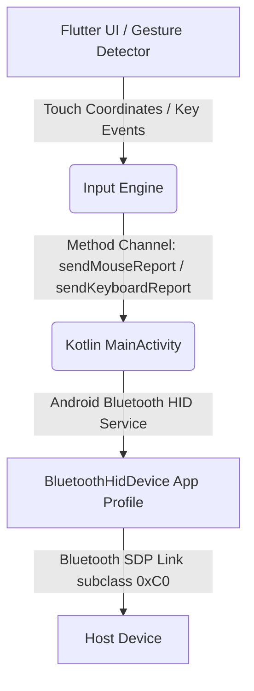

# CouchMouse

[](https://developer.android.com/reference/android/bluetooth/BluetoothHidDevice)
[](https://flutter.dev)

CouchMouse is an Android application that turns your device into a Bluetooth HID keyboard and trackpad. It emulates physical hardware over Bluetooth, which means it works without any client or server software on the host computer. Your computer, tablet, or smart TV treats it as a standard Bluetooth receiver device.

## Features

### True Driverless Connectivity
No background services, server applications, or desktop clients are needed on your computer. The app works with Windows, macOS, Linux, ChromeOS, iPadOS, and Android TV—any device that accepts standard Bluetooth input.

### Keyboard Layouts
The app includes interactive virtual keyboards supporting six layout options:
- Full-Size (100%): Standard layout with Function keys and a numeric keypad.
- Compact Full-Size (96%): Compressed layout keeping numeric input in a space-efficient form factor.
- Tenkeyless / TKL (80%): Standard layout without the numeric keypad.
- 75% Layout: Compact layout with arrow keys and a vertical navigation bar.
- 65% Layout: Compact layout retaining direct arrow key clusters.
- 60% Layout: Minimalist layout using translation layers for auxiliary keys.

### Trackpad Control
The trackpad provides precise cursor tracking and supports the following settings:
- Adjustable pointer sensitivity (DPI) and scroll speed.
- Toggleable mouse acceleration and scroll momentum.
- Reversible two-finger scroll direction.
- Left-handed or right-handed trackpad position layouts in landscape mode.
- Mouse click buttons (Left, Middle, Right) and a dedicated scroll wheel zone.

### Interface Modes
- Landscape Mode: Displays a side-by-side view pairing your selected keyboard layout with the trackpad. You can drag the boundaries or swap positions to suit left- or right-handed preferences.
- Portrait Mode: Focuses on single-hand trackpad navigation. Tapping the keyboard button activates the soft keyboard, which opens your device's native system input method editor (IME) to type. The app translates character inputs into HID scan codes, and a quick-access toolbar provides access to modifier keys (Ctrl, Shift, Alt, Win/Cmd), arrow keys, Esc, Tab, and Enter.

## System Architecture



### HID Descriptors
The device registers itself under subclass code `0xC0` (Combo Keyboard/Mouse) using a custom SDP (Service Discovery Protocol) configuration:

#### Keyboard Report (Report ID 1 - 8 Bytes)
- Byte 0: Modifier keys bitmask (Ctrl, Shift, Alt, GUI)
- Byte 1: Reserved padding byte (constant `0x00`)
- Bytes 2-7: Up to 6 active keycode bytes (6-key rollover)

#### Mouse Report (Report ID 2 - 4 Bytes)
- Byte 0: Mouse buttons bitmask (Left Click = `0x01`, Right Click = `0x02`, Middle Click = `0x04`)
- Byte 1: Signed relative X displacement (-127 to 127)
- Byte 2: Signed relative Y displacement (-127 to 127)
- Byte 3: Signed relative scroll wheel vertical movement (-127 to 127)

## Requirements

### System Requirements
- Android 9.0 (API Level 28) or higher is required. The native `BluetoothHidDevice` APIs do not exist on older versions.
- The host device must support Bluetooth keyboards and mice.

### iOS Support Limitation
This approach cannot be ported to iOS. Apple's CoreBluetooth framework restricts third-party applications from registering or broadcasting standard Bluetooth HID service records (such as HID over GATT or Bluetooth Classic SDP profiles). Consequently, native, driverless keyboard and mouse emulation is not possible on iOS without jailbreaking, private APIs, or an external hardware micro-controller bridge (e.g., an ESP32 or Raspberry Pi Pico) to act as the physical peripheral.

### Required Permissions
The app requests the following permissions at runtime:
- `BLUETOOTH_CONNECT`: Access paired Bluetooth devices.
- `BLUETOOTH_ADVERTISE`: Allow discovery by host systems.
- `BLUETOOTH_SCAN`: Search for host systems.
- `ACCESS_FINE_LOCATION`: Required on older Android SDKs for Bluetooth scanning.

## Development Setup

### Prerequisites
- Flutter SDK (Stable Channel)
- Android SDK (API 28+)

### Installation and Build
1. Clone the repository:
   ```bash
   git clone https://github.com/yourusername/couchmouse.git
   cd couchmouse
   ```
2. Get dependencies:
   ```bash
   flutter pub get
   ```
3. Build and run in release mode:
   ```bash
   flutter run --release
   ```
   *Note: Running in release mode minimizes latency for pointer gestures.*

## How to Use

1. Turn on Bluetooth on both your phone and the host computer.
2. Open CouchMouse and grant the requested permissions.
3. Open the computer's Bluetooth settings.
4. In CouchMouse, tap the connection dashboard and select **Make Discoverable**.
5. Select your phone from the list of available Bluetooth devices on your computer.
6. Once paired, select your host machine from the device list in CouchMouse and press **Connect**.
7. Rotate your screen horizontally for the side-by-side keyboard and trackpad, or hold it vertically for single-hand trackpad use.
